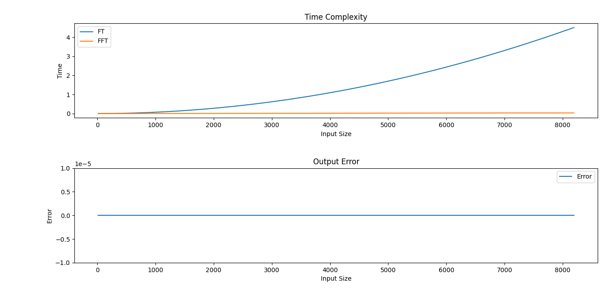

# Implementing FT & FFT in C++ 

This code aims to implement Fourier transform (`FT`) & fast Fourier transform (`FFT`) to calrify the difference betweem them showing that FT takes much more time than FFT

## the Ouput

From the output plot, we can see that FT time complexity is in the order of *`(N^2)`* while FFT is in the order of *`(N log(N))`*.
The output error is *almost* zero.
